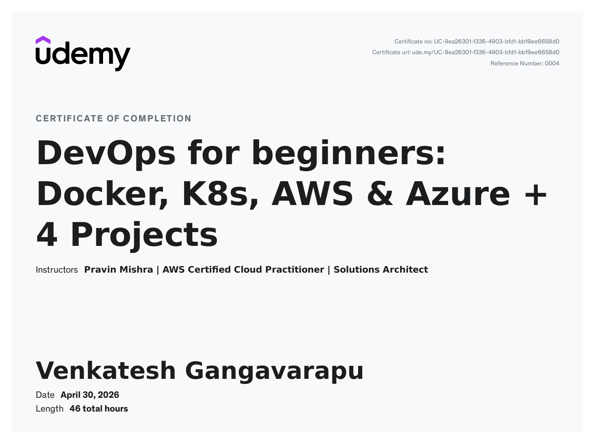

<div align="center">

# DevOps Micro Internship (DMI) — Venkatesh Gangavarapu

### 15-week hands-on DevOps program — built, deployed, and shipped publicly.

[](https://linkedin.com/in/venkatesh-gangavarapu)
[](https://linkedin.com/in/venkatesh-gangavarapu)


</div>

---

## About This Repository

This repo documents my complete **DevOps Micro Internship** journey — 15 weeks of hands-on assignments, real cloud deployments, and working infrastructure, all pushed to GitHub as proof of execution.

**What makes this different from a typical DevOps portfolio:**
- Every week has a **real deliverable** — not notes, not theory, working deployments
- Each assignment includes **working code**, **screenshots**, and a **reflection**
- The progression is visible: from Linux fundamentals all the way to Agentic AI pipelines and Terraform IaC
- Real problems were hit and documented — 502 errors, SSL enforcement, region availability constraints — and solved
- Week 9 deployed a **live AWS site using Claude Code's agentic pipeline** with zero manual Terraform commands

> *"Watching is not progress. Shipping is progress."* — Pravin Mishra, DMI

---

## Progress Tracker

| # | Week | Topic | Key Deliverable | Status |
|:---:|:---:|---|---|:---:|
| 1 | [Week 01](./week-01-mindset-and-foundations/) | Mindset & Foundations | 7 personal development assignments, goal system | ✅ |
| 2 | [Week 02](./week-02-production-ops-and-linux/) | Production Ops & Linux | React on Ubuntu + Nginx, 6-phase production drill | ✅ |
| 3 | [Week 03](./week-03-docker-containerization/) | Docker & Containerization | CodeTrack app containerized with Dockerfile | ✅ |
| 4 | [Week 04](./week-04-kubernetes-and-deployments/) | Kubernetes & Cloud Deployments | Portfolio + GoToJob deployed on K8s | ✅ |
| 5 | [Week 05](./week-05-consolidated-revision/) | Consolidated Revision (Weeks 1–4) | Linux, Git, AWS, CI/CD — all reinforced hands-on | ✅ |
| 6 | [Week 06](./week-06-aws-core-services/) | AWS Core Services | Book Review App (3-tier), Portfolio on EC2, S3 + CloudFront | ✅ |
| 7 | Week 07 | Azure Fundamentals *(Practice — Weeks 1–6 consolidation)* | Azure CLI, Resource Groups, VMs — foundations for Week 08 | ✅ |
| 8 | [Week 08](./week-08-azure-deployments/) | Azure Advanced Deployments | 3-tier Load Balancer architecture, EpicBook + MySQL | ✅ |
| 9 | [Week 09](./week-09-agentic-ai-devops/) | Agentic AI DevOps | Live AWS S3 + CloudFront deployed via Claude Code pipeline | ✅ |
| 10 | [Week 10](./week-10-terraform-and-iac/) | Terraform & Infrastructure as Code | Azure VM stack provisioned via Terraform — full lifecycle | ✅ |
| 11 | Week 11 | Consolidated Revision *(Practice — Weeks 6–10)* | Docker, K8s, AWS, Azure, Terraform — reinforced hands-on | ✅ |
| 12 | [Week 12](./week-12-ansible/) | Ansible & Configuration Management | Ansible onboarding, EpicBook prod deploy, mini-finance, static site | ✅ |
| 13 | [Week 13](./week-13-azure-devops/) | Azure DevOps & CI/CD Pipelines | ReactApp + EpicBook automated via Azure DevOps pipelines | ✅ |
| 14 | [Week 14](./week-14-docker/) | Docker Advanced & Capstone | Multi-stage builds, EpicBook capstone, Docker fundamentals | ✅ |
| 15 | [Week 15](./week-15-k8s-lab/) | Kubernetes Lab | Full K8s lifecycle — Pods, ReplicaSets, Deployments, Services, HPA | ✅ |
| ★ | [BookReview Capstone](./BookReview-Project/) | Full-Stack Capstone Project | Next.js + Express + MySQL → Docker → EKS + Aurora RDS via Terraform + Azure DevOps CI/CD | ✅ |

> **Week 07** — Practice week consolidating Weeks 1–6 (Linux, Docker, K8s, AWS). Azure CLI basics and resource group fundamentals covered to prepare for the advanced Azure deployments in Week 08.
>
> **Week 11** — Practice week consolidating Weeks 6–10 (AWS, Azure, Terraform, Docker Compose, Kubernetes). Reinforcing deployment patterns, IaC lifecycle, and config management before advancing to Ansible in Week 12.
>
> **Week 13** — Azure DevOps CI/CD pipelines for ReactApp and EpicBook — automated build, test, and deploy pipelines using Azure Pipelines YAML.
>
> **Week 14** — Docker advanced: single and multi-stage builds, EpicBook containerization capstone. Production image optimization and layer caching.
>
> **Week 15** — Kubernetes Lab: full workload lifecycle covering Pods, ReplicaSets, Deployments, three Service types (ClusterIP, NodePort, LoadBalancer), liveness and readiness probes, and Horizontal Pod Autoscaling. Deliberately broken configurations included to build real debugging muscle.
>
> **BookReview Capstone** — Standalone capstone project synthesising the full 15-week stack: 3-tier Next.js + Express + MySQL app containerised with Docker Compose, deployed to AWS EKS with Aurora RDS via modular Terraform (VPC / EKS / RDS modules), and automated end-to-end through a 3-stage Azure DevOps pipeline (Build → Infra → Deploy).

---

## Stats

<div align="center">

| Weeks Completed | Cloud Providers | Real Deployments | Assignments Done | Capstone Projects |
|:---:|:---:|:---:|:---:|:---:|
| 15 / 15 | AWS + Azure | 15+ | 30+ | 1 |

</div>

---

## Certification

<div align="center">

[](https://ude.my/UC-9ea26301-f336-4903-bfd1-bb19ee6658d0)

**DevOps for beginners: Docker, K8s, AWS & Azure + 4 Projects**
*Pravin Mishra — AWS Certified Cloud Practitioner | Solutions Architect*
Completed: April 30, 2026 · 46 hours

[](https://ude.my/UC-9ea26301-f336-4903-bfd1-bb19ee6658d0)

<a href="https://ude.my/UC-9ea26301-f336-4903-bfd1-bb19ee6658d0" target="_blank">
  
</a>

</div>

---

## Featured Work

### BookReview App — Full-Stack Capstone Project

The capstone that ties the full 15-week stack together. A production-grade **three-tier book review application** built, containerised, provisioned, and shipped entirely with the tools learned across the internship.

```
Browser → Next.js Frontend (Port 3000)
              ↓
          Express.js REST API (Port 3001) — JWT Auth, bcrypt
              ↓
          MySQL / Aurora RDS — Sequelize ORM
```

**What was built:**

| Layer | Technology | Detail |
|---|---|---|
| Frontend | Next.js 15, Tailwind CSS, Axios | SSR, dynamic routes (`/book/[id]`), React Context for auth state |
| Backend | Express.js, Sequelize ORM | REST API — users, books, reviews; JWT middleware |
| Database | MySQL 8 / Aurora RDS | Containerised locally; Aurora on AWS for production |
| Containers | Docker, Docker Compose | Single-file local orchestration of all 3 tiers with health checks |
| Kubernetes | EKS manifests — namespace, Deployments, Services, ConfigMap, Secrets | 2 replicas per tier; backend ClusterIP, frontend NLB |
| IaC | Terraform — modular structure | Three modules: `vpc`, `eks`, `rds` — full AWS stack from `terraform apply` |
| CI/CD | Azure DevOps 3-stage pipeline | **Build** (Docker → ECR) → **Infra** (Terraform EKS + Aurora) → **Deploy** (kubectl rollout) |
| Config Mgmt | Ansible roles — `common`, `frontend`, `backend` | EC2-based provisioning alternative to K8s |

**Deployment pipeline flow:**

```
git push main
    │
    ▼
Stage 1 — Build   : docker build → push backend + frontend to ECR  (~5–8 min)
    │
    ▼
Stage 2 — Infra   : terraform init → plan → apply  (VPC + EKS + Aurora RDS)  (~20–30 min)
    │
    ▼
Stage 3 — Deploy  : kubectl apply manifests → rollout status → print NLB URL  (~3–5 min)
```

**Why this matters:** Every skill from the 15 weeks contributes here — Linux, Docker, K8s, AWS, Terraform, Ansible, and Azure DevOps CI/CD — assembled into a single automated path from code commit to live production URL.

[View BookReview Capstone →](./BookReview-Project/)

---

### Week 12 — Ansible & Configuration Management

Production-grade configuration management: automated multi-app deployments across EpicBook, mini-finance, and static sites — zero manual server setup.

**Ansible Onboarding Environment built:**
- Python virtual environment with pinned dependencies (`ansible` 13.5.0 + `ansible-core` 2.20.4)
- `ansible-lint` 26.4.0 + `pre-commit` hooks (`yamllint` + `ansible-lint`) to enforce playbook quality before every commit
- `ansible.cfg` with SSH pipelining enabled, YAML callback, and role path configuration
- VS Code workspace integration + `.editorconfig` standards (UTF-8, LF, 2-space indent)

**Apps deployed via Ansible:**

| Project | What Was Automated |
|---|---|
| `epicbook-prod` | Full EpicBook production deployment — provisioning, config, service start |
| `mini-finance` | Finance app server provisioning and deployment |
| `static-web` | Static website deploy via `site.yml` playbook |
| `ansible-azure-lab` | Azure-specific Ansible environment |

**Why this matters:** Ansible turns a sequence of manual SSH commands into a repeatable, version-controlled playbook. Every app above can be redeployed to a fresh server with one command — that's the operational shift from scripts to configuration management.

[View Week 12 →](./week-12-ansible/)

---

### Week 09 — Agentic AI DevOps with Claude Code

The standout week. A fully working **agentic deployment pipeline** — no manual Terraform, no manual AWS CLI commands. Claude Code handled everything end-to-end.

```
/scaffold-terraform → terraform init → /tf-plan → /tf-apply → /deploy → Live on AWS
```

**What was built:**
- `CLAUDE.md` — project context file that teaches Claude the rules of the deployment
- 4 Claude Code Skills with scoped tool permissions: `/scaffold-terraform`, `/tf-plan`, `/tf-apply`, `/deploy`
- MCP integration — Terraform + AWS live tool access (not training data guesses)
- 3-layer safety hook system: **SAY** (prompt guard) / **DO** (command guard) / **LOG** (audit trail)
- Live static portfolio deployed to **AWS S3 + CloudFront**

**Why this matters:** Most DevOps pipelines still require a human to run `terraform apply` manually. This pipeline removes that entirely while keeping three safety checkpoints to prevent accidental infrastructure changes — the kind of production-readiness thinking that matters in real teams.

[View Week 09 →](./week-09-agentic-ai-devops/)

---

### Week 10 — Terraform & Infrastructure as Code

Provisioned a complete Azure VM infrastructure stack using Terraform — from `terraform init` to `terraform destroy`, with CLI validation at each step.

```
terraform init → terraform plan → terraform apply → az vm list -d → terraform destroy
```

Six Azure resources defined in HCL — Resource Group, VNet, Subnet, Public IP, NIC, Ubuntu VM — with full separation into `main.tf`, `variables.tf`, `outputs.tf`, and `provider.tf`.

**Key insight:** Terraform resolves resource dependency order automatically by reading HCL references — you declare the desired state, not the execution sequence.

[View Week 10 →](./week-10-terraform-and-iac/)

---

### Week 08 — Azure Advanced Deployments

**Assignment 1: Three-Tier Network Architecture on Azure**

Self-healing infrastructure with Azure Load Balancer automatically routing away from unhealthy VMs.

```
Internet → Azure Load Balancer → Web Tier (Nginx VMs) → App Subnet → DB Subnet
          with health probes                              (Private)    (Private)
```

- Azure VNet (10.0.0.0/16) with 3 isolated subnets for web / app / database tiers
- Public Load Balancer with TCP health probes — removes unhealthy VMs automatically
- Azure Bastion for secure browser-based SSH (no exposed SSH ports)
- NSGs enforcing subnet-level firewall rules

**Assignment 2: EpicBook Full Stack on Azure** — real issues hit and solved:

| Problem | Root Cause | Fix |
|---|---|---|
| 502 Bad Gateway | Nginx proxy_pass pointing to wrong port | Read `package.json` to find actual app port (8080) |
| DB connection failure | Azure MySQL enforces SSL by default | Added `ssl: { rejectUnauthorized: false }` in config |
| Region not available | MySQL Flexible Server unavailable in free-tier region | Switched to supported region |

[View Week 08 →](./week-08-azure-deployments/)

---

### Week 06 — AWS Core Services: Book Review App (3-Tier)

Full-stack three-tier application deployed on AWS EC2 with Docker Compose.

```
Browser → Next.js Frontend (Port 3000)
              ↓
          Express.js API (Port 5000) — JWT Auth, bcrypt
              ↓
          MySQL Database — Sequelize ORM
```

- Ansible playbooks with roles (common, frontend, backend) for repeatable provisioning
- Docker Compose orchestrating all three tiers from a single file
- JWT authentication + bcrypt password hashing
- CORS handling, environment variable management

Also in Week 06: Portfolio on EC2 + static site hosting on S3 with CloudFront CDN.

[View Week 06 →](./week-06-aws-core-services/)

---

## Real Problems Solved in Production

These are actual failures hit during deployments — not from tutorials but from real infrastructure:

| Week | Problem | Root Cause | Fix |
|---|---|---|---|
| Week 02 | App not responding after deploy | Nginx config not reloaded after changes | `systemctl reload nginx` |
| Week 06 | Docker container crashing on start | Missing `.env` file not mounted | Added volume mount in docker-compose |
| Week 08 | 502 Bad Gateway on Azure | `proxy_pass` port mismatch | Read `package.json` — app was on 8080, not 3000 |
| Week 08 | Azure MySQL refusing connections | Managed service enforces SSL by default | Added SSL config to connection string |
| Week 08 | Resource deployment failure | MySQL Flexible Server not available in chosen region | Checked availability matrix, switched regions |
| Week 12 | Pre-commit hook blocking commit | `ansible-lint` finding playbook violations | Fixed playbook formatting, re-staged and committed |

---

## Full Tech Stack

| Category | Technologies | Used In |
|---|---|---|
| **Cloud — AWS** | EC2, S3, CloudFront, IAM, VPC, EKS, Aurora RDS, ECR | Weeks 06, 09; BookReview Capstone |
| **Cloud — Azure** | VMs, VNet, Subnets, Load Balancer, MySQL Flexible Server, NSGs, Bastion | Weeks 07, 08, 10 |
| **IaC** | Terraform (AWS + Azure), HCL | Weeks 09, 10 |
| **Config Management** | Ansible (playbooks, roles, lint, pre-commit hooks) | Weeks 06, 12 |
| **Containers** | Docker, Docker Compose, multi-stage builds | Weeks 03, 06, 14 |
| **Orchestration** | Kubernetes (Pods, ReplicaSets, Deployments, Services, HPA, health probes) | Weeks 04, 15 |
| **CI/CD** | GitHub Actions (multi-job YAML pipelines), Azure DevOps Pipelines | Weeks 02, 05, 13 |
| **Web Server** | Nginx (reverse proxy, static hosting, load config) | Weeks 02, 06, 08 |
| **Agentic AI** | Claude Code, CLAUDE.md, Skills, MCP, Safety Hooks | Week 09 |
| **App Runtime** | Node.js, Express.js, Next.js, React, PM2 | Weeks 02, 06, 08 |
| **Databases** | MySQL, Sequelize ORM, Azure MySQL Flexible Server | Weeks 06, 08 |
| **Auth & Security** | JWT, bcrypt, NSGs, Azure Bastion, SSL/TLS | Weeks 06, 08 |
| **OS & Shell** | Linux (Ubuntu), Bash, systemctl, journalctl | Weeks 01–12 |
| **Version Control** | Git, GitHub (branching, PRs, clean commits) | All weeks |
| **Process Manager** | PM2 (auto-restart, production Node.js) | Week 08 |

---

## Repository Structure

```
DevOps-Micro-Internship-DMI/
├── README.md                              ← You are here
│
├── BookReview-Project/                    ← Full-stack capstone (standalone)
│   ├── frontend/                          ← Next.js 15 (Tailwind CSS, Axios, React Context)
│   ├── backend/                           ← Express.js REST API, Sequelize ORM, JWT auth
│   ├── terraform/                         ← Modular IaC: modules/vpc, modules/eks, modules/rds
│   ├── k8s/                               ← Kubernetes manifests — namespace, Deployments, Services
│   ├── ansible/                           ← Ansible roles: common, frontend, backend
│   ├── docker-compose.yml                 ← Local 3-container orchestration with health checks
│   ├── azure-pipeline.yaml                ← 3-stage Azure DevOps CI/CD: Build → Infra → Deploy
│   └── DEPLOYMENT.md                      ← End-to-end deployment guide (EKS + Aurora via Azure DevOps)
│
├── week-01-mindset-and-foundations/       ← 7 assignments: beliefs, metrics, system plan
├── week-02-production-ops-and-linux/      ← React on Nginx, 6-phase production drill
│   ├── production-ops/
│   ├── react-app-deployment-ubuntu-nginx/
│   └── professional-website-project/
│
├── week-03-docker-containerization/       ← CodeTrack containerized with Docker
│   └── CodeTrack/
│
├── week-04-kubernetes-and-deployments/    ← Portfolio + GoToJob on Kubernetes
│   ├── Pravin-Mishra-Portfolio-Template/
│   └── gotto_job/
│
├── week-05-consolidated-revision/         ← Weeks 1–4 reinforced hands-on
│
├── week-06-aws-core-services/             ← 3-tier Book Review App, EC2, S3, CloudFront
│   ├── book-review-app/                   ← Next.js + Express + MySQL + Docker Compose
│   ├── Pravin-Mishra-Portfolio-Template/  ← Deployed on EC2
│   └── static-website-s3/                ← S3 + CloudFront static hosting
│
│   [Week 07 — Practice: Azure CLI fundamentals, resource groups — no separate folder]
│
├── week-08-azure-deployments/             ← 3-tier LB architecture, EpicBook + MySQL
│   ├── azure-three-tier-architecture/
│   ├── epicbook-azure-deployment/
│   ├── book-review-app/
│   └── my-react-app/
│
├── week-09-agentic-ai-devops/             ← Claude Code pipeline → S3 + CloudFront
│   └── Ultimate-Agentic-DevOps-with-Claude-Code/
│
├── week-10-terraform-and-iac/             ← Azure VM stack via Terraform — full lifecycle
│   ├── Week-10-Terraform-Azure/           ← Complete: main.tf, variables.tf, outputs.tf
│   ├── Week-10-Terraform-AWS/
│   ├── Week-10-BookReview-3Tier/
│   ├── Week-10-BookReview-Terraform-Azure/
│   ├── Week-10-EpicBook-AWS/
│   └── Week-10-React-Azure/
│
│   [Week 11 — Practice: Weeks 6–10 revision — Docker, K8s, AWS, Azure, Terraform]
│
├── week-12-ansible/                       ← Ansible config management — multiple app deploys
│   ├── ansible-onboarding/                ← Dev environment: venv, lint, pre-commit hooks
│   ├── epicbook-prod/                     ← EpicBook production deployment
│   ├── mini-finance/                      ← Finance app provisioning
│   ├── static-web/                        ← Static site with site.yml playbook
│   └── ansible-azure-lab/                 ← Azure-specific Ansible lab
│
├── week-13-azure-devops/                  ← Azure DevOps CI/CD pipelines
│   ├── reactapp-cicd/                     ← React app pipeline (Azure Pipelines YAML)
│   └── theepicbook-cicd/                  ← EpicBook automated build + deploy pipeline
│
├── week-14-docker/                        ← Docker advanced & capstone
│   ├── docker-fundamentals/               ← Core Docker concepts
│   ├── single-and-multi-stage-docker/     ← Single vs multi-stage build comparison
│   └── epicbook-capstone/                 ← EpicBook production containerization
│
├── week-15-k8s-lab/                       ← Full Kubernetes workload lifecycle lab
│   ├── pods/
│   ├── replicasets/
│   ├── deployments/
│   ├── services/                          ← ClusterIP, NodePort, LoadBalancer
│   ├── health-probes-liveness/
│   ├── health-probes-readiness/
│   └── autoscaling/                       ← HPA (min 2 / max 5 replicas)
│
└── assets/
    └── DevOps-Certification.jpg           ← Udemy Certificate of Completion
```

---

## About the Program

**DevOps Micro Internship** by [Pravin Mishra](https://www.linkedin.com/in/pravin-mishra-aws-trainer/) — a structured, execution-first 15-week program covering the full modern DevOps stack.

Every module follows the same discipline:

> Learn → Lab → Assignment → Push to GitHub → Document

No passive watching. Every week ships working infrastructure.

---

## Connect

I'm actively looking for **remote or visa-sponsored** opportunities in DevOps / Cloud Engineering / Platform Engineering / SRE.

<div align="center">

[](https://linkedin.com/in/venkatesh-gangavarapu)
[](https://github.com/venkatesh-gangavarapu)

</div>

---

<div align="center">
<sub>DevOps Micro Internship &nbsp;·&nbsp; Pravin Mishra &nbsp;·&nbsp; Venkatesh Gangavarapu &nbsp;·&nbsp; 2025–2026</sub>
</div>
