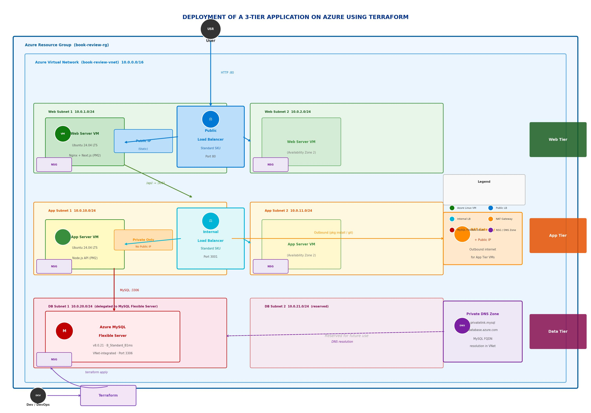

# Book Review App - Terraform Infrastructure (Azure)

This repository contains a complete Terraform scaffold for deploying a three-tier web application on **Microsoft Azure** with load balancing and a managed MySQL database.

## Architecture Overview



## Project Structure

```
book-review-terraform-iac/
├── main.tf                    # Root module — orchestrates all modules
├── variables.tf               # Root-level variable definitions
├── outputs.tf                 # Root-level outputs (IPs, DB endpoint)
├── terraform.tfvars           # Variable values (EXCLUDED from git)
├── .gitignore                 # Git ignore rules for sensitive files
├── deployment.md              # Application deployment guide
├── README.md                  # This file
│
├── scripts/
│   ├── backend-userdata.sh    # Auto-runs on app VM boot (Node.js + PM2)
│   └── frontend-userdata.sh   # Auto-runs on web VM boot (Next.js + Nginx)
│
└── modules/
    ├── networking/            # VNet, subnets, NAT Gateway, DNS zone, LB IPs
    │   ├── main.tf
    │   ├── variables.tf
    │   └── outputs.tf
    │
    ├── security/              # Network Security Groups (NSGs) per subnet tier
    │   ├── main.tf
    │   ├── variables.tf
    │   └── outputs.tf
    │
    ├── compute/               # Linux VMs — web server and app server
    │   ├── main.tf
    │   ├── variables.tf
    │   └── outputs.tf
    │
    ├── loadbalancer/          # Public and internal Azure Standard Load Balancers
    │   ├── main.tf
    │   ├── variables.tf
    │   └── outputs.tf
    │
    └── database/              # Azure MySQL Flexible Server
        ├── main.tf
        ├── variables.tf
        └── outputs.tf
```

## Module Descriptions

### 1. **networking** (`modules/networking/`)
Creates the entire network foundation for the application.

**Creates:**
- Resource Group containing all project resources
- Virtual Network (VNet) — replaces AWS VPC
- Public subnets (2): For web tier
- Private subnets (2): For app tier
- Delegated subnets (2): For MySQL Flexible Server (subnet delegation required by Azure)
- NAT Gateway + Public IP: Outbound internet for private app subnets
- Pre-allocated static Public IP for the public Load Balancer
- Private DNS Zone (`privatelink.mysql.database.azure.com`) + VNet link for MySQL FQDN resolution
- Deterministic static private IP for the internal Load Balancer (10th host of app subnet CIDR)

> **Note:** The public LB IP is pre-allocated here (not in the loadbalancer module) to avoid a circular dependency — compute needs the LB IP in user_data scripts, while loadbalancer needs compute NIC IDs.

**Dependencies:** None (foundational)

---

### 2. **security** (`modules/security/`)
Defines Network Security Groups (NSGs) and associates them with subnets.

> In Azure, NSGs attach to **subnets** (not individual VMs as in AWS).

**Creates NSGs for:**
- **web_nsg**: Web subnets — allows port 80 from Internet, SSH (22) from Internet, Azure LB health probes
- **app_nsg**: App subnets — allows port 3001 from web subnets only, SSH (22) from web subnets, Azure LB probes; explicit deny-all overrides Azure default `AllowVnetInBound`
- **db_nsg**: DB subnet — allows port 3306 from app subnets only; explicit deny-all

**Dependencies:** VNet subnets (from networking module)

---

### 3. **compute** (`modules/compute/`)
Provisions Azure Linux Virtual Machines for web and app tiers.

**Creates:**
- **Web Server VM**: Ubuntu 24.04 LTS, public subnet, public IP, runs Next.js + Nginx via `frontend-userdata.sh`
- **App Server VM**: Ubuntu 24.04 LTS, private subnet, no public IP, runs Node.js backend via `backend-userdata.sh`
- SSH authentication using an SSH public key (not a key pair name as in AWS)
- Both VMs use `custom_data` (base64-encoded) to run user_data scripts at first boot

**Key Differences from AWS:**
- SSH key is passed as public key **content** (not a named key pair)
- `custom_data` must be base64 encoded (Terraform handles this automatically)
- OS disk is explicitly declared (implicit in AWS `aws_instance`)

**Dependencies:** VNet subnets, NSGs, LB IPs (from networking module), DB endpoint (from database module)

---

### 4. **loadbalancer** (`modules/loadbalancer/`)
Sets up Azure Standard Load Balancers for traffic distribution.

**Creates:**
- **Public Load Balancer**: Receives traffic on port 80, routes to web server backend pool; uses pre-allocated public IP from networking module
- **Internal Load Balancer**: Receives traffic on port 3001, routes to app server backend pool; uses static private IP from app subnet
- **Backend Pools** + **NIC Associations**: Register VM NICs into respective LB pools
- **TCP Health Probes**: Port 80 (web), port 3001 (app), 30s interval, 2 failures threshold

**Dependencies:** VNet, compute NICs, pre-allocated LB IPs (from networking module)

---

### 5. **database** (`modules/database/`)
Creates a managed Azure MySQL Flexible Server.

**Creates:**
- Azure MySQL Flexible Server — VNet-integrated via delegated subnet (no public endpoint)
- Application database within the server
- Private DNS zone resolves the FQDN within the VNet

**Configuration:**
- Port: 3306 (MySQL default)
- Engine: MySQL 8.0.21
- SKU: `B_Standard_B1ms` (Burstable — equivalent to db.t3.micro)
- Storage: 20 GB with auto-grow enabled
- Backup retention: 7 days
- Zone: 1 (single-zone; geo-redundant backup disabled)

> **Note:** Azure reserves usernames `admin`, `root`, `administrator` etc. Use `dbadmin` or similar.

**Dependencies:** Delegated DB subnet, Private DNS zone (from networking module)

---

## File Descriptions

### Root Level Files

**`main.tf`**
- Configures the `azurerm` provider (~> 3.0)
- Calls all 5 modules in dependency order
- Injects `frontend-userdata.sh` and `backend-userdata.sh` as `templatefile()` with LB IPs and DB credentials
- Module call order: networking → security + database → compute → loadbalancer

**`variables.tf`**
- Defines all input variables with types, descriptions, and defaults
- `ssh_public_key` and `db_admin_password` are marked `sensitive = true`

**`outputs.tf`**
- `webserver_pub_ip` — Web server VM public IP
- `appserver_prvt_ip` — App server VM private IP
- `db_endpoint` — MySQL Flexible Server FQDN (use as `DB_HOST`)
- `public_lb_ip` — Public LB IP (application entry point)
- `private_lb_ip` — Internal LB private IP

**`terraform.tfvars`**
- Contains actual values for all variables
- ⚠️ **Already in `.gitignore`** — DO NOT commit (contains SSH key and DB password)

---

## What to Set Up First

### Step 0: Prerequisites
```bash
# Install Terraform (v1.0+)
terraform --version

# Install Azure CLI
az --version

# Log in to Azure
az login

# Set your target subscription (if you have multiple)
az account set --subscription "<your-subscription-id>"
```

### Step 1: Generate SSH Key Pair
```bash
# Generate a new key pair locally
ssh-keygen -t rsa -b 4096 -C "your@email.com" -f ~/.ssh/book-review-key

# View the public key — you will paste this into terraform.tfvars
cat ~/.ssh/book-review-key.pub
```

### Step 2: Configure Variables
```bash
# Edit terraform.tfvars with your values
nano terraform.tfvars
```

**Required values in `terraform.tfvars`:**
```hcl
azure_location = "centralindia"          # Azure region
project        = "book-review"           # Used for all resource naming

# Virtual Network address space
vpc_cidr_block    = "10.0.0.0/16"

# Subnet CIDR blocks (must be within VPC CIDR)
web_subnet_1_cidr = "10.0.1.0/24"
web_subnet_2_cidr = "10.0.2.0/24"
app_subnet_1_cidr = "10.0.10.0/24"
app_subnet_2_cidr = "10.0.11.0/24"
db_subnet_1_cidr  = "10.0.20.0/24"      # Delegated to MySQL Flexible Server
db_subnet_2_cidr  = "10.0.21.0/24"

# VM sizes
web_vm_size = "Standard_D2as_v4"
app_vm_size = "Standard_D2as_v4"

# SSH public key content (paste the output of: cat ~/.ssh/book-review-key.pub)
ssh_public_key = "ssh-rsa AAAA..."

# Database configuration
db_name           = "bookreview"
db_admin_username = "dbadmin"            # Cannot be 'admin', 'root', 'administrator'
db_admin_password = "YourSecurePassword123!"   # Change this!
db_sku_name       = "B_Standard_B1ms"   # Burstable tier (dev/test)
db_storage_size_gb = 20
mysql_version     = "8.0.21"
```

### Step 3: Initialize Terraform
```bash
terraform init
# Downloads azurerm provider and initializes working directory
```

### Step 4: Validate Configuration
```bash
terraform validate
# Checks syntax and configuration for errors
```

### Step 5: Plan Deployment
```bash
terraform plan
# Shows what will be created — review before applying
```

### Step 6: Deploy Infrastructure
```bash
terraform apply
# Creates all resources in Azure
# Type 'yes' when prompted
```

> **Note:** VM provisioning takes 5–10 minutes. The user_data scripts (`frontend-userdata.sh` and `backend-userdata.sh`) run automatically at first boot — no manual SSH steps required.

### Step 7: Verify Deployment
```bash
# View all outputs
terraform output

# Get the public LB IP (application entry point)
terraform output public_lb_ip

# Get the DB FQDN
terraform output db_endpoint

# SSH to web server (for debugging)
terraform output webserver_pub_ip
ssh -i ~/.ssh/book-review-key ubuntu@<web-ip>

# Check user_data logs on web server
sudo cat /var/log/frontend-user-data.log

# SSH to app server via web server (bastion jump)
ssh -i ~/.ssh/book-review-key -J ubuntu@<web-ip> ubuntu@<app-private-ip>

# Check user_data logs on app server
sudo cat /var/log/backend-user-data.log
```

---

## Important Configuration Notes

### SSH Key
- Pass the full **public key content** (not a filename or key pair name)
- The private key (`~/.ssh/book-review-key`) is used for SSH access after deployment

### Database Username
- Azure reserves `admin`, `root`, `administrator`, `azure_superuser`, and several others
- Use `dbadmin` or another non-reserved username

### Circular Dependency Resolution
The public LB IP is pre-allocated in the `networking` module so it is available before VMs are created. This allows the IP to be injected into `frontend-userdata.sh` (as `NEXT_PUBLIC_API_URL`) and `backend-userdata.sh` (as `ALLOWED_ORIGINS`) without creating a circular dependency between `compute` and `loadbalancer`.

### Networking CIDR Blocks
All subnet CIDRs must be within the VNet address space:
- VNet: `10.0.0.0/16`
- Web subnets: `10.0.1.0/24`, `10.0.2.0/24`
- App subnets: `10.0.10.0/24`, `10.0.11.0/24`
- DB subnets: `10.0.20.0/24`, `10.0.21.0/24`

---

## Common Tasks

### View All Outputs
```bash
terraform output
```

### Destroy Everything
```bash
terraform destroy
# Type 'yes' when prompted
```

### Destroy a Specific Resource
```bash
terraform destroy -target=module.database.azurerm_mysql_flexible_server.book_review_db
```

### Update Configuration
```bash
# Edit terraform.tfvars
nano terraform.tfvars

# Preview changes
terraform plan

# Apply changes
terraform apply
```

### View Current State
```bash
terraform state list                        # List all managed resources
terraform state show <resource_address>     # Details of a specific resource
```

---

## Troubleshooting

**Q: "The subscription is not registered to use namespace 'Microsoft.DBforMySQL'"**
- A: Register the provider: `az provider register --namespace Microsoft.DBforMySQL`

**Q: "InvalidParameterValue: The administrator login name is not valid"**
- A: Azure reserves `admin`, `root`, `administrator` etc. Use `dbadmin` or similar.

**Q: "SSH key rejected / Permission denied (publickey)"**
- A: Ensure `ssh_public_key` in `terraform.tfvars` is the full key content starting with `ssh-rsa`

**Q: "App not reachable after deployment"**
- A: Wait 5–10 minutes for user_data scripts to complete. Check logs: `sudo cat /var/log/frontend-user-data.log`

**Q: "Backend health probe failing"**
- A: Ensure the Node.js app is running: `pm2 status` on the app server; check `pm2 logs bk-backend`

**Q: "terraform init fails"**
- A: Ensure Azure CLI is installed and you are logged in: `az login`

**Q: "Quota exceeded for VM size"**
- A: Change `web_vm_size` / `app_vm_size` to a smaller SKU (e.g., `Standard_B2s`) or request a quota increase in Azure Portal

---

## Next Steps

1. Deploy following the "What to Set Up First" section above
2. Read [deployment.md](deployment.md) for user_data script details and post-deployment verification
3. Open the app at `http://<public_lb_ip>` once VMs finish booting
4. Configure monitoring via Azure Monitor / Log Analytics

---

## Variable Reference

See `variables.tf` for complete variable definitions including:
- Type constraints
- Default values
- Descriptions
- Sensitive flags

---

## Security Considerations

- ✅ NSGs enforce strict tier isolation at the subnet level
- ✅ App tier only reachable from web tier (ports 3001, 22)
- ✅ Database only reachable from app tier (port 3306, no public endpoint)
- ✅ MySQL Flexible Server uses VNet integration — no public internet exposure
- ✅ Secrets excluded from git (`.gitignore` covers `terraform.tfvars`, state files)
- ⚠️ Change `db_admin_password` from the example value before deploying
- ⚠️ Restrict SSH inbound in `web_nsg` to your IP in production (not `Internet`)
- ⚠️ Replace `JWT_SECRET=mysecret` in `backend-userdata.sh` before production use

---

## Support & Resources

- [Terraform AzureRM Provider Docs](https://registry.terraform.io/providers/hashicorp/azurerm/latest/docs)
- [Azure MySQL Flexible Server Docs](https://learn.microsoft.com/en-us/azure/mysql/flexible-server/overview)
- [Azure Standard Load Balancer Docs](https://learn.microsoft.com/en-us/azure/load-balancer/load-balancer-overview)
- [Terraform Best Practices](https://www.terraform.io/docs/cloud/guides/recommended-practices)

---

## Author

**Venkatesh Gangavarapu**

- LinkedIn: [www.linkedin.com/in/venkatesh-gangavarapu](https://www.linkedin.com/in/venkatesh-gangavarapu)
- GitHub: [www.github.com/venkatesh-gangavarapu](https://www.github.com/venkatesh-gangavarapu)
